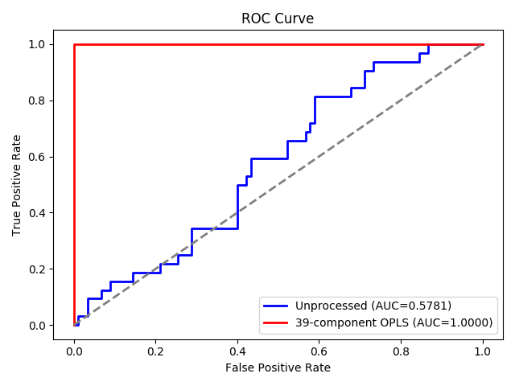
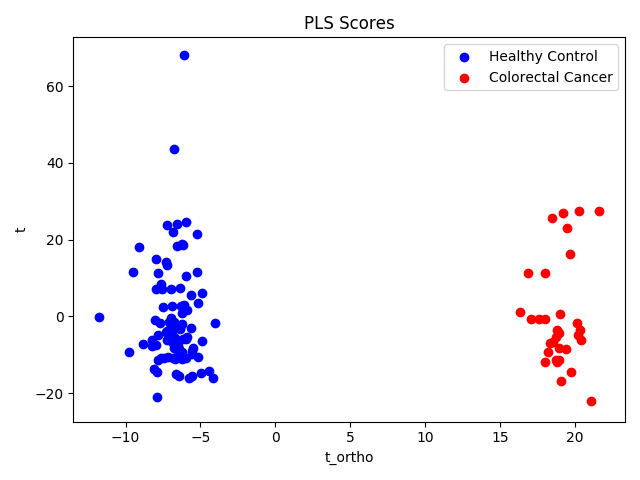

# pyopls - Orthogonal Projection to Latent Structures in Python. 
[](https://travis-ci.org/BiRG/pyopls)

This package provides a scikit-learn-style transformer to perform OPLS.
OPLS is a pre-processing method to remove variation from the descriptor 
variables that are orthogonal to the target variable (1).

This package also provides a class to validate OPLS models using a 
1-component PLS regression with cross-validation and permutation tests (2)
for both regression and classification metrics (from permutations of the
target) and feature PLS loadings (from permutations of the features).

## Table of Contents
1. [Installation](#installation)
2. [Notes](#notes)
3. [Examples](#examples) 
   1. [OPLS and PLS-DA](#opls-and-pls-da)
   2. [Validation](#validation)
4. [References](#references)
5. [Data Acknowledgment](#data-acknowledgment)


## Installation
pyopls is available via [pypi](https://pypi.org/project/pyopls/):
```shell
pip install pyopls
```
You may also install directly from this repository for the current
master: 
```shell
pip install git+git://github.com/BiRG/pyopls.git
```
New versions are uploaded to pypi whenever the version number is
incremented in `setup.py` on the master branch.


## Notes
* The implementation provided here is equivalent to that of the 
  [libPLS MATLAB library](http://libpls.net/), which is a faithful
  recreation of Trygg and Wold's algorithm.
  *   This package uses a different definition for R<sup>2</sup>X, however (see
      below)
* `OPLS` inherits `sklearn.base.TransformerMixin` (like
  `sklearn.decomposition.PCA`) but does not inherit 
  `sklearn.base.RegressorMixin` because it is not a regressor like
  `sklearn.cross_decomposition.PLSRegression`. You can use the output of
  `OPLS.transform()` as an input to another regressor or classifier.
* Like `sklearn.cross_decomposition.PLSRegression`, `OPLS` will center
  both X and Y before performing the algorithm. This makes centering by
  class in PLS-DA models unnecessary.
* The `score()` function of `OPLS` performs the R<sup>2</sup>X score, the
  ratio of the variance in the transformed X to the variance in the
  original X. A lower score indicates more orthogonal variance removed.
* `OPLS` only supports 1-column targets.

## Examples
### OPLS and PLS-DA
A CSV file containing 1H-NMR spectra for 118 serum samples of patients
with colon cancer diagnoses and healthy controls is located in
`colorectal_cancer_nmr.csv` in the root of this repository (see
acknowledgment below).
 
OPLS-processed data require only 1 PLS component. Performing a
39-component OPLS improves cross-validated accuracy from 70% to 100%,
AUC from .578 to 1 and DQ<sup>2</sup> (3) from 0.04 to 0.99.

```python
import pandas as pd
import numpy as np
import matplotlib.pyplot as plt
from sklearn.metrics import roc_curve, roc_auc_score
from pyopls import OPLS
from sklearn.cross_decomposition import PLSRegression
from sklearn.model_selection import cross_val_predict, LeaveOneOut
from sklearn.metrics import r2_score, accuracy_score


spectra = pd.read_csv('colorectal_cancer_nmr.csv', index_col=0)
spectra = spectra[spectra.classification.isin(['Colorectal Cancer', 'Healthy Control'])]
target = spectra.classification.apply(lambda x: 1 if x == 'Colorectal Cancer' else -1)
spectra = spectra.drop('classification', axis=1)

opls = OPLS(39)
Z = opls.fit_transform(spectra, target)

pls = PLSRegression(1)
y_pred = cross_val_predict(pls, spectra, target, cv=LeaveOneOut())
q_squared = r2_score(target, y_pred)  # -0.107
dq_squared = r2_score(target, np.clip(y_pred, -1, 1))  # -0.106
accuracy = accuracy_score(target, np.sign(y_pred))  # 0.705

processed_y_pred = cross_val_predict(pls, Z, target, cv=LeaveOneOut())
processed_q_squared = r2_score(target, processed_y_pred)  # 0.981
processed_dq_squared = r2_score(target, np.clip(processed_y_pred, -1, 1))  # 0.984
processed_accuracy = accuracy_score(target, np.sign(processed_y_pred))  # 1.0

r2_X = opls.score(spectra)  # 7.8e-12 (most variance is removed)

fpr, tpr, thresholds = roc_curve(target, y_pred)
roc_auc = roc_auc_score(target, y_pred)
proc_fpr, proc_tpr, proc_thresholds = roc_curve(target, processed_y_pred)
proc_roc_auc = roc_auc_score(target, processed_y_pred)

plt.figure(0)
plt.plot(fpr, tpr, lw=2, color='blue', label=f'Unprocessed (AUC={roc_auc:.4f})')
plt.plot(proc_fpr, proc_tpr, lw=2, color='red',
         label=f'39-component OPLS (AUC={proc_roc_auc:.4f})')
plt.plot([0, 1], [0, 1], color='gray', lw=2, linestyle='--')
plt.xlabel('False Positive Rate')
plt.ylabel('True Positive Rate')
plt.title('ROC Curve')
plt.legend(loc='lower right')
plt.show()

plt.figure(1)
pls.fit(Z, target)
df = pd.DataFrame(np.column_stack([pls.x_scores_, opls.T_ortho_[:, 0]]),
                  index=spectra.index, columns=['t', 't_ortho'])                           
pos_df = df[target==1]
neg_df = df[target==-1]
plt.scatter(neg_df['t'], neg_df['t_ortho'], c='blue', label='Healthy Control')
plt.scatter(pos_df['t'], pos_df['t_ortho'], c='red', label='Colorectal Cancer')
plt.title('PLS Scores')
plt.xlabel('t_ortho')
plt.ylabel('t')
plt.legend(loc='upper right')
plt.show()
```
#### ROC Curve
 
#### Scores Plot

### Validation
The `fit()` method of `OPLSValidator` will find the optimum number of
components to remove, then evaluate the results on a 1-component
`sklearn.cross_decomposition.PLSRegression` model. A permutation test is
performed for each metric by permuting the target and for the PLS
loadings by permuting the features.
 
This snippet will determine the best number of components to remove,
perform permutation tests for regression metrics and perform two-tailed
permutation tests for each feature (bin) relative to it's loading. The
feature permutation tests for the colorectal cancer dataset would take
quite some time, as they require that the model be fit as many as 874k
times. So instead, we look at the
[UCI ML Wine Dataset](https://archive.ics.uci.edu/ml/datasets/Wine)
provided by
[scikit-learn](https://scikit-learn.org/stable/modules/generated/sklearn.datasets.load_wine.html)
The feature permutation tests reveal that hue and malic acid do not
differentate class 1 from class 0.

```python
import pandas as pd
from pyopls import OPLSValidator
from sklearn.datasets import load_wine

wine_data = load_wine()
df = pd.DataFrame(wine_data['data'], columns=wine_data['feature_names'])
df['classification'] = wine_data['target']
df = df[df.classification.isin((0, 1))]
target = df.classification.apply(lambda x: 1 if x else -1)  # discriminant for class 1 vs class 0
X = df[[c for c in df.columns if c!='classification']]

validator = OPLSValidator(k=-1).fit(X, target)

Z = validator.opls_.transform(X)

feature_df = pd.DataFrame()
feature_df['feature_name'] = wine_data['feature_names']
feature_df['feature_p_value'] = validator.feature_p_values_
feature_df['feature_loading'] = validator.pls_.x_loadings_
print(feature_df.loc[feature_df.feature_loading.abs().sort_values(ascending=False).index].to_markdown())  # Pandas 1.0+ required for to_markdown
```
#### Feature importances
|    | feature\_name                | feature\_p\_value | feature\_loading |
|---:|:-----------------------------|------------------:|-----------------:|
| 12 | proline                      |      0.00990099   |        0.385955  |
|  9 | color_intensity              |      0.00990099   |        0.381981  |
|  0 | alcohol                      |      0.00990099   |        0.379567  |
|  6 | flavanoids                   |      0.00990099   |        0.359975  |
|  5 | total_phenols                |      0.00990099   |        0.336182  |
| 11 | od280/od315_of_diluted_wines |      0.00990099   |        0.299045  |
|  3 | alcalinity_of_ash            |      0.00990099   |       -0.239887  |
|  2 | ash                          |      0.00990099   |        0.22916   |
|  7 | nonflavanoid_phenols         |      0.00990099   |       -0.224338  |
|  4 | magnesium                    |      0.00990099   |        0.18662   |
|  8 | proanthocyanins              |      0.00990099   |        0.181767  |
|  1 | malic_acid                   |      0.564356     |        0.0293328 |
| 10 | hue                          |      0.623762     |        0.0210777 |

## References
1. Johan Trygg and Svante Wold. Orthogonal projections to latent structures (O-PLS).
   *J. Chemometrics* 2002; 16: 119-128. DOI: [10.1002/cem.695](https://dx.doi.org/10.1002/cem.695)
2. Eugene Edington and Patrick Onghena. "Calculating P-Values" in *Randomization tests*, 4th edition.
   New York: Chapman & Hall/CRC, 2007, pp. 33-53. DOI: [10.1201/9781420011814](https://doi.org/10.1201/9781420011814).
3. Johan A. Westerhuis, Ewoud J. J. van Velzen, Huub C. J. Hoefsloot, Age K. Smilde. Discriminant Q-squared for 
   improved discrimination in PLSDA models. *Metabolomics* 2008; 4: 293-296. 
   DOI: [10.1007/s11306-008-0126-2](https://doi.org/10.1007/s11306-008-0126-2)

## Data Acknowledgment
The test dataset provided at `pyopls/tests/colorectal_cancer_nmr.csv` is
available at the NIH Common Fund's National Metabolomics Data Repository
(NMDR) website, the Metabolomics Workbench,
[https://metabolomicsworkbench.org] where it has been assigned Project
ID PR000227. The data can be accessed directly via it's Project DOI
[10.21228/M89P43](https://dx.doi.org/10.21228/M89P43). This work is
supported by NIH grant, U2C-DK119886. 

*Note*: The test dataset consists only of those spectra belonging to
samples labeled "Colorectal Cancer" or "Healthy Control". The "target"
variable has the value -1 for samples labeled "Healthy Control" and
value +1 for samples labeled "Colorectal Cancer".
